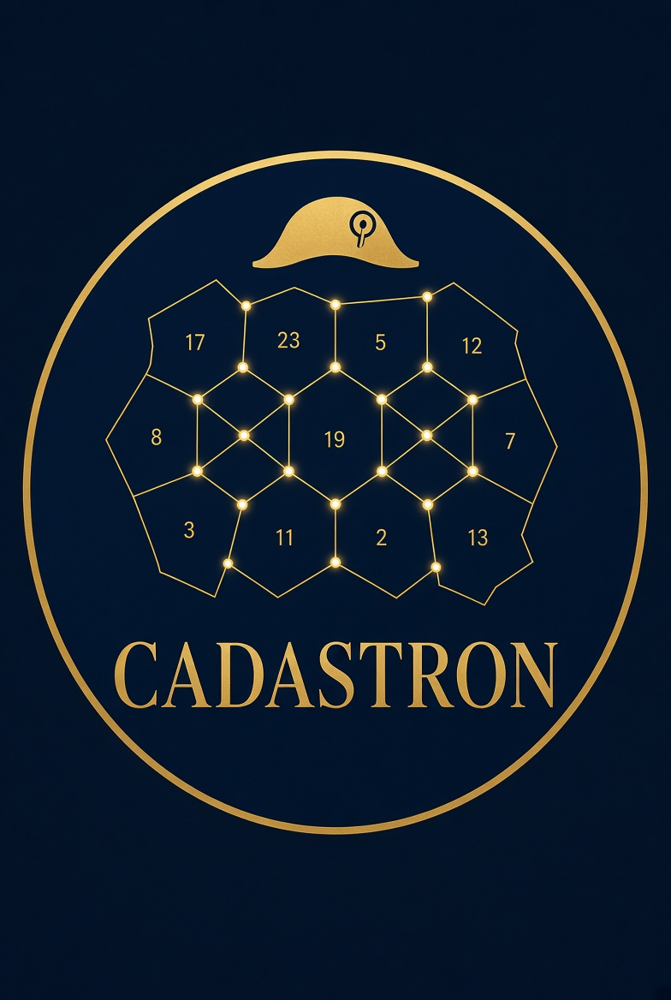
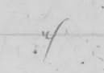

<p align="center">
  
</p>

<h1 align="center">Cadastron</h1>

<p align="center">
  Numérisation et transcription assistée des registres cadastraux napoléoniens.
</p>

---

## Le projet

Les **matrices cadastrales napoléoniennes** sont des registres manuscrits du XIXe siècle, imprimés selon un gabarit fixe de colonnes (numéro de plan, propriétaire, nature, contenances, classement, revenu imposable, portes et fenêtres...) et remplis à la main. Chaque scan haute résolution du registre contient deux pages manuscrites en vis-à-vis, séparées par la gouttière de reliure.

**Cadastron** transforme ces scans en un tableur ODS exploitable, avec un onglet par page manuscrite, en préservant l'intégralité des colonnes imprimées du gabarit d'origine.

## Pipeline

Pour chaque scan (`images/*.jpg`) :

1. **Découpage** — détection automatique de la gouttière de reliure et séparation en deux pages physiques (en mémoire, aucun fichier intermédiaire écrit sur disque).
2. **Redressement** — correction de l'inclinaison de chaque page (`deskew`).
3. **Détection de la grille imprimée** — repérage automatique des 14 colonnes du gabarit à partir des traits imprimés (pas de découpage naïf, calé sur le contenu réel de chaque page).
4. **Segmentation des lignes** — détection des lignes manuscrites avec [Kraken](https://kraken.re/) (`blla`).
5. **Regroupement en lignes de tableau** — association des segments détectés aux bonnes colonnes/lignes de la grille.
6. **Reconnaissance (optionnelle)** — transcription automatique via un modèle Kraken entraîné (voir [Entraînement du modèle](#entraînement-du-modèle) ci-dessous) ; en son absence, les images de chaque ligne sont conservées pour transcription manuelle ou entraînement futur.
7. **Export ODS** — écriture d'un classeur `output/cadastron.ods` avec un onglet par page (~380 pages attendues).

## Structure du projet

```
cadastron/
├── cadastron/            # package principal
│   ├── config.py         # schéma des 14 colonnes du gabarit
│   ├── gutter.py          # détection de la gouttière / découpage en mémoire
│   ├── preprocess.py      # redressement, binarisation
│   ├── columns.py         # détection de la grille de colonnes imprimée
│   ├── segment.py         # segmentation des lignes (Kraken blla)
│   ├── rows.py             # regroupement des lignes en cellules (ligne, colonne)
│   ├── recognize.py       # reconnaissance de texte (Kraken, modèle entraîné)
│   ├── ods_writer.py      # génération du classeur ODS
│   └── pipeline.py        # orchestration bout en bout (CLI)
├── training/                 # entraînement du modèle de reconnaissance
│   ├── base_model.py         # localise/télécharge le modèle de base McCATMuS
│   ├── prepare_finetune.py   # rassemble les lignes et crée les .gt.txt à remplir
│   ├── finetune_cadastre.py  # fine-tuning de McCATMuS sur le cadastre
│   ├── prepare_timeus.py     # préparation du corpus TIMEUS (banc d'essai)
│   └── eval_model.py         # mesure la précision d'un modèle sur TIMEUS
├── images/                 # scans sources (non versionnés)
└── output/                 # classeur ODS + images de lignes générées
```

## Installation

```bash
pip install -r requirements.txt
```

> Sous Windows avec GPU NVIDIA, réinstallez `torch` avec le bon index CUDA si `pip install kraken` a installé une version CPU :
> ```bash
> pip install --index-url https://download.pytorch.org/whl/cu124 --force-reinstall --no-deps torch torchvision
> ```

## Utilisation

```bash
# Pipeline complet sur tous les scans de images/
python -m cadastron.pipeline --images-dir images --output output/cadastron.ods

# Test rapide sur les 2 premiers scans
python -m cadastron.pipeline --limit 2

# Avec un modèle de reconnaissance
python -m cadastron.pipeline --rec-model "$(python training/base_model.py)"
```

> `training/base_model.py` affiche le chemin du modèle de base McCATMuS (et le
> télécharge à la première exécution) ; la substitution `$(...)` suppose un shell
> POSIX — sous `cmd`, copiez le chemin affiché. Une fois le fine-tuning fait,
> remplacez-le par le modèle obtenu (`training/models/cadastre/best_*.safetensors`).

Sans `--rec-model`, les cellules du tableau restent vides mais chaque ligne détectée est sauvegardée dans `output/lines/<page>/` avec un `layout.json`, afin de pouvoir réconcilier une transcription (manuelle ou automatique) ultérieure avec le classeur.

## Entraînement du modèle

La stratégie est un **fine-tuning en une étape** à partir de [McCATMuS](https://doi.org/10.5281/zenodo.13788177), modèle générique de transcription pour documents français manuscrits, imprimés et dactylographiés du XVIe au XXIe siècle.

### Pourquoi McCATMuS plutôt qu'un modèle maison

Le projet visait d'abord un modèle de base entraîné sur le [corpus TIMEUS](https://github.com/HTR-United/timeuscorpus) (registres administratifs français pré-imprimés du XIXe siècle — même genre de document, même outillage eScriptorium/Kraken). Mesurés sur ce même corpus, les deux approches ne se comparent pas :

| Modèle | Précision caractère | Précision mot |
|---|---|---|
| Entraîné de zéro sur TIMEUS (248 pages, 5 h de GPU) | 27,3 % | — |
| **McCATMuS, sans aucun entraînement** | **91,2 %** | **73,8 %** |

248 pages sont très loin de ce qu'il faut pour apprendre l'écriture manuscrite française du XIXe à partir d'une initialisation aléatoire : l'entraînement plafonnait dès la 7ᵉ époque. Un modèle générique bien entraîné constitue un bien meilleur point de départ, et TIMEUS est reversé au rôle de **banc d'essai indépendant** (`eval_model.py`).

### Procédure

```bash
# 1. Extraire les lignes du cadastre
python -m cadastron.pipeline

# 2. Rassembler les lignes et créer les fichiers de transcription vides
python training/prepare_finetune.py

# 3. Transcrire à la main les lignes dans training/cadastre_gt/*.gt.txt
#    (suivre l'avancement)
python training/prepare_finetune.py --status

# 4. Fine-tuner McCATMuS sur ces transcriptions
python training/finetune_cadastre.py --device cuda:0

# 5. Mesurer le résultat sur le banc d'essai TIMEUS
python training/prepare_timeus.py          # une seule fois
python training/eval_model.py --device cuda:0 --model training/models/cadastre/best_0.9xxx.safetensors
```

`ketos` écrit ses sorties dans le **répertoire** `training/models/cadastre/` : un
`checkpoint_<époque>-<précision>.ckpt` par époque, et le meilleur modèle sous la
forme `best_<précision>.safetensors` — c'est ce dernier fichier qu'on passe à
`--model` et à `--rec-model`, son nom variant selon la précision atteinte.

Sous Windows, `training/run_training.bat` lance l'étape 4 dans une console dédiée qui survit à la fermeture de l'éditeur, en archivant la sortie dans `training/finetune_log.txt`.

### Conventions de transcription

- Transcrire **exactement** ce qui est écrit : ni correction d'orthographe, ni développement des abréviations.
- Le signe **ditto**  — qui reprend la valeur de la cellule **au-dessus dans la même colonne**, et non la ligne entière — se note `/` et se laisse tel quel. Sa résolution est un post-traitement, colonne par colonne ; le modèle, lui, doit apprendre à reconnaître le glyphe.
- Laisser le fichier vide si la ligne est illisible : elle est alors exclue de l'entraînement.

Le fine-tuning conserve l'alphabet de McCATMuS et y ajoute les caractères propres au cadastre (`ketos --resize union`), afin de ne pas détruire le transfert d'apprentissage.

## État d'avancement

- [x] Découpage automatique de la gouttière et des pages
- [x] Détection automatique de la grille des 14 colonnes (validée sur scans réels)
- [x] Export ODS multi-onglets
- [x] Segmentation des lignes manuscrites (Kraken)
- [x] Reconnaissance branchée de bout en bout (`--rec-model`, API Kraken 7)
- [x] Choix du modèle de base : McCATMuS, 91,2 % sur le banc d'essai TIMEUS
- [ ] Transcription manuelle de quelques centaines de lignes du cadastre
- [ ] Fine-tuning de McCATMuS sur le cadastre napoléonien
- [ ] Résolution du signe ditto en post-traitement (par colonne)
- [ ] Traitement bout en bout des ~384 scans / ~768 pages
