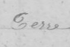
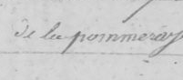
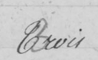
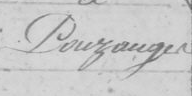
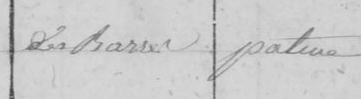
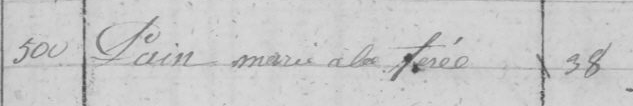
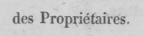
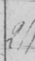

# Transcrire le cadastre

**Notice à l'usage des bénévoles.** Comment recopier les lignes du registre cadastral napoléonien pour apprendre à l'ordinateur à les lire tout seul.

---

## Ce que vous allez faire

Le registre a été photographié page par page, puis découpé automatiquement en milliers de petites images. Chaque image contient **une seule ligne d'écriture**, prélevée dans une case du tableau.

À côté de chaque image se trouve un fichier texte qui porte le même nom, terminé par `.gt.txt`. Il est vide. Votre travail tient en une phrase : **ouvrir l'image, lire la ligne, et taper dans le fichier texte ce que vous avez lu.**

1. Ouvrez l'image, par exemple `2_b__r006_c05_l00.png`.
2. Ouvrez le fichier texte du même nom, `2_b__r006_c05_l00.gt.txt`.
3. Tapez ce que vous lisez sur l'image, puis enregistrez.
4. Passez à l'image suivante. Il n'y a rien d'autre à faire.

### Pourquoi ce travail est utile

L'ordinateur apprend à lire cette écriture **par l'exemple**. Chaque ligne que vous transcrivez est un exemple de plus. Au bout de quelques centaines, il commence à déchiffrer seul le reste du registre — plusieurs centaines de pages que personne n'aura à recopier à la main.

D'où la seule chose qui compte vraiment : **un exemple juste ou rien du tout.** Un fichier laissé vide ne coûte rien, il est simplement ignoré. Un fichier mal rempli, lui, enseigne quelque chose de faux et abîme le travail de tout le monde.

---

## Les trois règles

### 1. Recopiez exactement ce que vous voyez

Pas de correction d'orthographe, pas de mise au goût du jour, pas d'abréviation développée. Si le clerc a écrit `pommeray`, vous tapez `pommeray` — même si vous savez qu'on écrirait « pommeraie » aujourd'hui. Gardez les majuscules et les accents tels qu'ils sont sur la page.

### 2. Une image = une ligne

Le découpage est rectangulaire : il mord souvent sur la ligne du dessus ou celle du dessous, et parfois sur la colonne d'à côté. **Seule compte la ligne qui occupe le centre de l'image.** Tout ce qui n'est qu'un fragment sur un bord ne se transcrit pas.

### 3. Dans le doute, laissez vide

Illisible, ambigu, deux lignes également présentes, aucune vraiment au centre ? Laissez le fichier vide et passez à la suivante. C'est une réponse parfaitement valable, et de loin la plus utile en cas d'hésitation.

---

## Cas par cas

De vrais exemples tirés du registre, avec ce qu'il faut taper dans chaque cas.

### ✅ À transcrire — `Terre`



Le cas idéal : **un seul mot, bien au centre, rien qui dépasse.** Vous tapez le mot, vous enregistrez, c'est fini.

### ✅ À transcrire — `de la pommeray`



Plusieurs mots, c'est **normal et même souhaitable**. L'ordinateur lit des lignes entières, jamais des lettres isolées : plus la ligne est longue, plus elle lui apprend de choses. Ne découpez rien.

### ✅ À transcrire — `Trois`



La majuscule initiale est celle de la page : on la garde. On ne rajoute pas de point final s'il n'y en a pas.

### ✅ À transcrire — `Pouzauges`



Un morceau de la ligne du dessus dépasse en haut de l'image. **On l'ignore** : il appartient à une autre ligne, qui a sa propre image et son propre fichier. Seul `Pouzauges`, au centre, se transcrit.

### ⬜ Laisser vide — deux cases séparées par un trait



Deux mots séparés par un **trait vertical imprimé** : ce trait est une frontière de colonne, les deux mots appartiennent à deux cases différentes. Les taper tous les deux apprendrait à l'ordinateur à lire à travers les colonnes et à mélanger les cases. Fichier vide.

### ⬜ Laisser vide — une ligne entière du tableau



Même problème en pire : l'image traverse **toute la largeur du tableau** et plusieurs colonnes à la fois. Elle ne correspond à aucune case. Fichier vide.

### ⬜ Laisser vide — texte imprimé



Ceci est du **texte imprimé**, l'en-tête du formulaire — et non de l'écriture à la main. L'ordinateur doit apprendre l'écriture manuscrite ; lui montrer des caractères d'imprimerie ne sert à rien. On le reconnaît à son gris uniforme, ses lettres espacées et régulières, et son alignement parfaitement horizontal.

### ⬜ Laisser vide — illisible



Quelques traces d'encre, aucun mot lisible au centre. **N'essayez pas de deviner.** Fichier vide, on passe à la suite.

### ⚠️ Le bloc d'en-tête, en début de page

Les **trois à six premières images de chaque page** sont presque toujours l'en-tête imprimé du formulaire : `NOMS`, `CONTENANCES`, `des Propriétaires.`, `LIEUX DITS.` et ainsi de suite. Toutes sont à laisser vides.

C'est le piège le plus fréquent, parce que ces images arrivent en premier dans la liste. Passez-les sans hésiter : l'écriture à la main commence juste après.

---

## Le signe « même chose »


Ce signe, qui ressemble à une barre oblique, veut dire « **même valeur que la case juste au-dessus, dans la même colonne** ».

Quand vous le rencontrez, tapez simplement le caractère `/` et rien d'autre. **Ne le remplacez jamais par la valeur qu'il désigne** — c'est l'ordinateur qui s'en chargera plus tard, automatiquement. Vous, vous décrivez seulement ce qui est écrit sur la page.

Attention : il reprend la case du dessus **dans sa colonne**, jamais la ligne entière.

| Lieu-dit | Nature |
|---|---|
| La Pommeray | Terre |
| `/` | Pré |
| `/` | `/` |

Sur la dernière ligne, le premier `/` vaut « La Pommeray » et le second vaut « Pré ». Chacun regarde vers le haut, dans sa propre colonne.

---

## En pratique

- **Ne renommez ni ne déplacez aucun fichier.** L'image et son fichier texte sont appariés par leur nom : le moindre changement casse le lien entre les deux.
- **Une seule ligne de texte par fichier**, sans retour à la ligne. Si vous avez besoin d'appuyer sur Entrée, c'est probablement que l'image contient deux lignes — auquel cas laissez-la vide.
- **Enregistrez en UTF-8.** C'est indispensable pour que les accents soient conservés. Dans le Bloc-notes de Windows : `Fichier` → `Enregistrer sous`, puis choisissez `UTF-8` dans la liste « Encodage », en bas de la fenêtre.
- **Inutile de tout faire d'un coup.** Vous pouvez vous arrêter à n'importe quel moment : les fichiers déjà remplis sont conservés, ceux qui restent vides seront repris plus tard.
- **Pas de mise en forme.** Ni gras, ni italique, ni guillemets ajoutés : uniquement les caractères présents sur la page.

### Une hésitation ?

Ne tranchez pas au jugé : laissez le fichier vide et signalez-le au coordinateur. Sur des milliers de lignes, quelques cases vides ne se voient pas. Une lecture inventée, si.

---

Vous n'avez pas à déchiffrer le registre entier. Chaque ligne que vous recopiez fidèlement apprend à l'ordinateur à déchiffrer les suivantes.

---

## Pour le coordinateur

Suivi de l'avancement :

```bash
python training/prepare_finetune.py --status
```

Les fichiers `.gt.txt` déjà remplis ne sont jamais écrasés ; le script peut être relancé après chaque nouveau passage du pipeline. Comptez quelques centaines de lignes transcrites avant de lancer le fine-tuning (voir [README.md](README.md#entraînement-du-modèle)).
